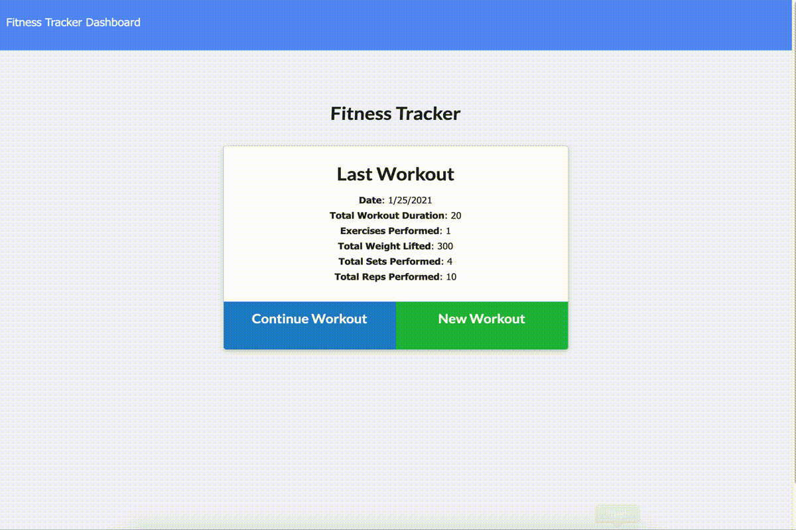

# Workout Tracker
Homework# 17 NoSQL: Workout Tracker

[Workout Tracker Deploy Link](https://workout-tracker-nmk.herokuapp.com/)

[](https://github.com/natemking/burger_banquet/blob/main/LICENSE)


---
## Table of Contents
 * [Description](#description)
    + [Scope of Work](#scope-of-work)
    + [MongoDB/Mongoose](#mongodb/mongoose)
    + [Node.js](#nodejs)
    + [HTML/CSS](#html/css)
  * [Screenshots](#screenshots)
  * [Installation Notes](#installation-notes)
  * [License](#license)
  * [Credits](#credits)

## Description

### Scope of Work
User Story:
```
As a user: 
I want to be able to view create and track daily workouts. 
I want to be able to log multiple exercises in a workout on a given day. 
I should also be able to track the name, type, weight, sets, reps, and duration of exercise. 
If the exercise is a cardio exercise, I should be able to track my distance traveled.
```

All of the front end code was provided. The assignment was to create the back end functionality so the user can add workouts and exercises to the database. MongoDB is the assigned database to use. 

### MongoDB/Mongoose
The database for this app is NoSQL MongoDB. To interface with Mongo, the Object Data Modeling library, Mongoose was used. 

I decided to see what I could really do with Mongoose. I designed a different index.js file than normally used in Mongoose applications. I was able to create an index.js file that operates the same way a Sequelize index.js file operates. The DB connections and models themselves are all controlled with the index.js file. This allows for better automation and makes any alterations to the models much less work. All you have to do is make your changes to the model and the index.js file will take care of the rest. In an application like this where there are limited models, it is a novelty but in large-scale apps with many models, it is a huge benefit. 

The next thing I challenge I chose to tackle was having two models. The app could have been done with one Workout model that contains all of the exercises but I felt that there should be more of a separation of concerns. That is why there is an Exercise model. I also had to build my exports differently to be more analogous with the way Sequelize does its model exports. 

Since we were provided a seeder file that was designed for a single model, I had to do some serious refactoring for my models to be seeded properly. I wrote a `seed()` function that splits the workouts data from the exercises data then pushes them to their respective collections. Then that new data for each collection is re-queried. Those results can then be iterated over and the newly created _id's for the exercises can be pushed to their respective workout. Finally, the workout data with its newly associated exercise _id's is inserted back into the workouts collection. 

### Node.js
The server functionally is a simple Node server that is utilizing the router method for the HTML and API routes. All of the mongoose CRU (no delete on the app) functions are handled in the API routes as per standard practice. 

The most challenging part of the routing was having both  '/api/workouts/id...' and 'api/workouts/range' give different query results without interfering with each other. The latter of the two was needed for the provided stats data to appear correctly in the charts on the stats page. I solved this with a simple `if` statement. If the `req.params.id === 'range'` then the specific data that is needed for the stats is called. Otherwise all other GET requests pull the data without limits and sorting set.

Another challenge I had to conquer was with calculating the `totalDuration` values on the workouts. The goal is to have one total sum in a workout from all of the exercise durations in that workout. Since I had separated the models, and the two collections weren't able to be joined in SQL style join, I faced an interesting dilemma. This was resolved in the PUT request. After a new exercise model is created, the workout for that exercise is queried. Next, when the workout is updated with the new exercise model, a simple calculation is done in the Mongoose `$set:` method.   

### HTML/CSS
No changes were made to the boilerplate code provided for anything on the front-end. My focus with the app was with the backend code and trying to go farther with the code than most given this assignment.


## Screenshots


<br>

_App Functionality_
<br>

## Installation Notes

The following node npm dependencies are used:
```
Express v4.16.3
Mongoose v5.3.16
Morgan v1.10.0
```
After forking run `npm i` to install the npm packages. 

## License
Licensed under the GNU GPLv3.0 License. Copyright © 2020

## Credits

* [Use async/await with Mongoose connection](https://gist.github.com/emilioriosvz/abdbe137737b830b21d66dc5f1236311)

* [Set up mongoose models like sequelize model set up](https://gist.github.com/AKIRA-MIYAKE/03b9ae80dbdf61bf28ef)

* [Creating relationships w/ Mongoose](https://dev.to/oluseyeo/how-to-create-relationships-with-mongoose-and-node-js-11c8)  

* [FindByIdAndUpdate $push in Mongoose](https://stackoverflow.com/questions/15621970/pushing-object-into-array-schema-in-mongoose)
* [Mongoose CRUD](https://coursework.vschool.io/mongoose-crud/)

* [Limit the most recent results in ascending order w/ Mongoose](https://stackoverflow.com/questions/39069491/how-to-get-last-5-docs-in-sequential-order)


---

GitHub: [@natemking](https://github.com/natemking/)

Email: [natmeking@gmail.com](mailto:natmeking@gmail.com)

